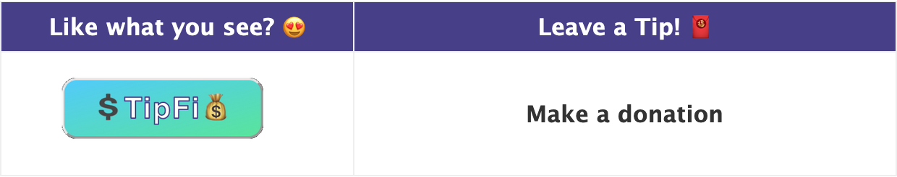
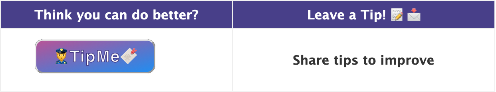
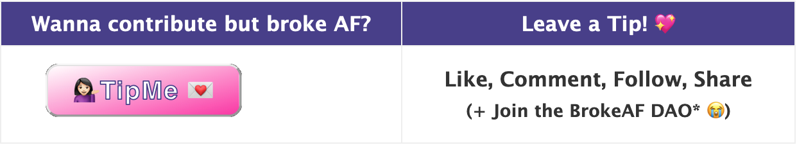
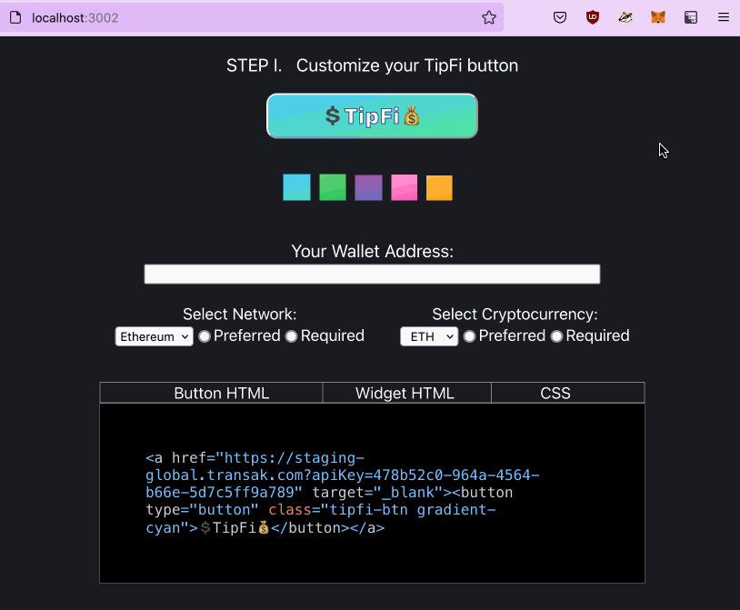
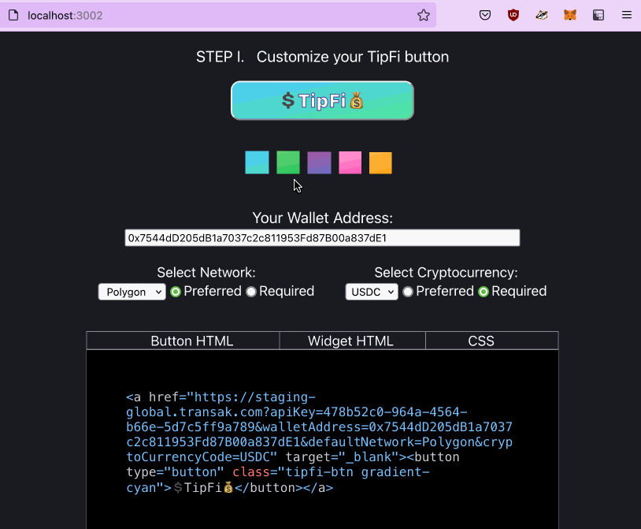
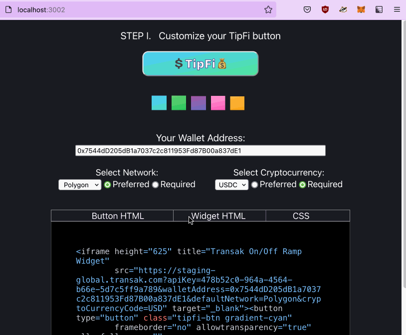
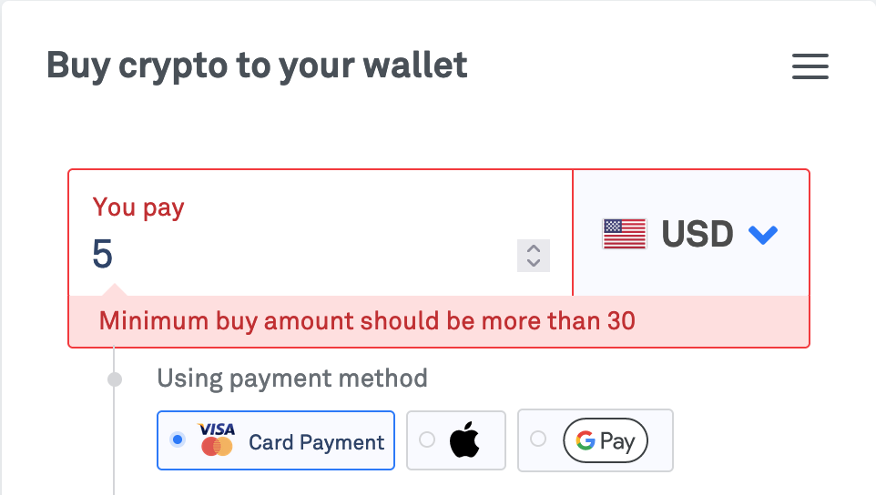
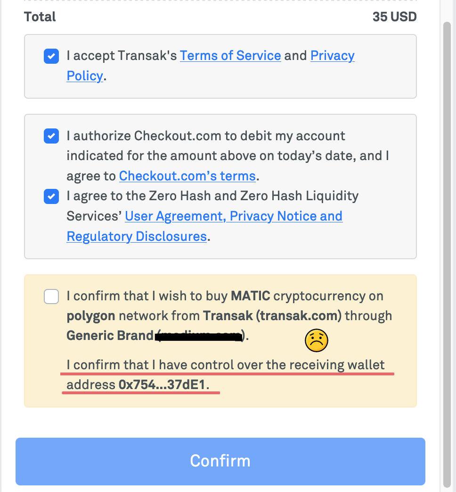

# TipFi 💰🧧 + TipMe 💌
<!-- Tipy, Tippy, Tippee -->

## How It Works

### 💰 TipFi 💸 
- Like Ko-fi + Buy Me A Coffee but P2P without an intermediary
- No middleman (algorithmically trusted)
    - tips go straight to designated crypto wallet
    - tippee receives 100% of tips
    - all transactions verifiable on public ledger
- Tip in crypto or fiat converted to crypto, KYC (Transak)
    - Supports many fiat currencies
    - Supports 100+ tokens in 120+ countries
    - Protocol/blockchain agnostic (unless restricted by user)
    - No minimum: tip as much or as little as desired
    - Latest price feeds (Chainlink)
- Pseudonymous tipping - no identifying user data stored in central storage
- Tip anywhere, anytime (global guarantee, 24/7)
    - Short, brandable domain, user login (Unstoppable Domains)
- Tip to one or tip in batches (one-to-one or one-to-many addresses)
- One button for many use cases
- Anyone can use (low barrier to entry)
    - easy to setup, no crypto jargon
    - tip and receive tips with or without a bank account(?)
    - withdraw, transfer, mint/stake? tokens immediately
- Donations that support independent artists, creators & contributors
    - contestants, content creators (bloggers, photographers, artists, authors, actors, musicians), waiters/waitresses, bussers, buskers, delivery courier, job applicants - (un)paid assessments, DAO contributors, gig workers, donations, independent crowdfunding (similar to Patreon)
- Invest in someone by investing in their work/potential
- Embed in any web page (blog, socials), document, form, email, open source repo, or LINK it
- Comfortable, familiar (trusted) UI
    - Similar to popular, Web2 trusted e-payment services (PayPal, Stripe, Venmo)?
    - No long wallet address sharing
        - save & verify once, update anytime
    - 1 button, 1 account
        - Hassle Free: click & go 💨
        - Easy Setup & Management: copy & paste code anywhere
        - Tailor to preferences (flexible / strict)
            - accept tips in certain currencies & networks, set min/max amts
                - e.g. PoS, carbon-neutral blockchains only
            - or let tippers decide how & how much to tip
        - Multiple wallet support
            - add or switch between wallets
    - Confidence that tips will always be sent to the intended address
    - Web3 onboarding
    - Eye-catching designs
- Track tips, clicks, conversions, trends, referrals (dashboard analytics)

 

### 💁🏻‍♀️💌 TipMe
- Leave a Tip (Share Feedback, Show Support)

 

## 💻🖱&nbsp; User Flow
- **STEP 1** - Customize button
    - Option #1 
        - Creator embeds one of:  
            - Customized TipFi btn OR 
            - Fiat ⮕ Crypto widget on external site (copy & paste HTML code) 
    - Option #2 
        - Creator shares:  
            - link to user profile page or doc within TipFi/TipMe dapp (URL, QR code)
        * Combining options 1 & 2 - OK (encouraged) 
            - e.g. professional + personal
    
     

- **STEP 2** - View Analytics
    - Creator Dashboard 
        - Login to view analytics for wallet address 
            - Total Tips, Tips per day, Past 7 days (Graph/Chart)   

> "Add TipFi to a page, form, email. Or stay right here. We'll handle the rest!"

 

## 🍥&nbsp; Template for Creators (TL;DR)
 

 
 

 

 
 

    
 &nbsp;&nbsp; About #BrokeAFDAO 😭</strong>

    

    <blockquote>&nbsp; A fictitious, made-up DAO of one <strong>🙋🏻‍♀️</strong> 
    &nbsp; Coming soon to a CHAIN NEAR you! <strong>👀</strong> </blockquote>

 

## ✅&nbsp; Transak Integration Demo

#### </> Generate HTML
Enter your wallet address, customize blockchain network & cryptocurrency options, and select integration type (Button / Widget).  
Copy the generated HTML code & paste it in your website, blog, or email.

 
 

#### 🖼 Generate CSS - Styling
Choose a gradient color for your button.  
Copy the generated CSS code & paste it in your website, blog, or email.

 
 

#### ✔︎👉 Checkpoint: Transak integration test
Click button to preview Transak integration.

 

 

## ⛔️&nbsp; Dead End
<!-- <h2> ♚ Checkmate</h2> -->
- Transak requires $30 minimum per transaction.  
 $30 minimum tip is impractical for mass adoption.

&nbsp;&nbsp;&nbsp;&nbsp;&nbsp;&nbsp; 

 

- Sending tips is against Transak's Terms of Service, unfortunately <strong>😕</strong> 
Transak users must "have control over the receiving wallet address".  

<table>
  <tr>
    <th width='350'>&nbsp;&nbsp;&nbsp;&nbsp;&nbsp;&nbsp;  </th>
    <th style="text-align:left" width='250'>&nbsp;&nbsp;&nbsp;&nbsp;&nbsp;&nbsp; <video src="https://user-images.githubusercontent.com/91639796/168200052-3be8045a-14ea-4430-af19-02a83835cb70.mp4" controls width='450'>
  Your browser does not support the video tag.
</video> </th>
  </tr>
</table>